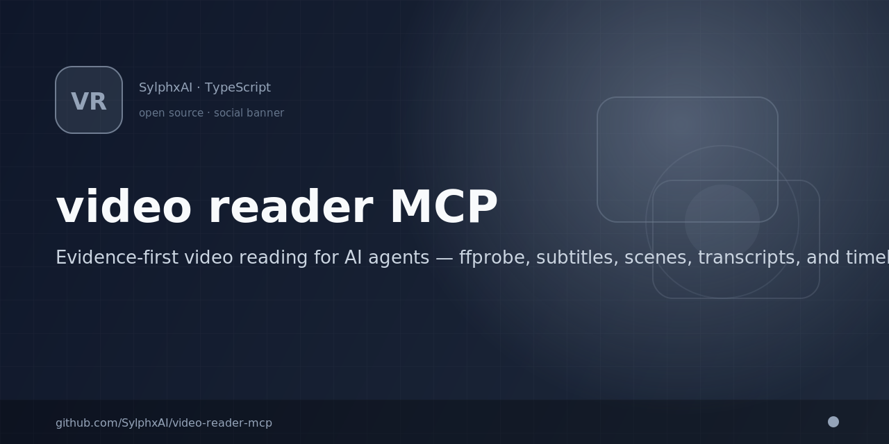

<div align="center">

# 🎬 Video Reader MCP

<p align="center">
  
</p>


### Your agent watched the video. **Did it read the timeline?**

Evidence-first video reading for AI agents. One call turns any local video into a
**timeline document** — ffprobe streams, chapters, embedded subtitles, scene
boundaries, and warnings you can cite without frame-by-frame vision LLM calls.

[](https://www.npmjs.com/package/@sylphx/video-reader-mcp)
[](https://opensource.org/licenses/MIT)
[](https://github.com/SylphxAI/video-reader-mcp/actions/workflows/ci.yml)
[](https://www.typescriptlang.org/)

**Local-first** · **One smart `read_video` call** · **Timeline evidence + provenance** · **20 tests**

SOTA family roadmap: [docs/roadmap/sota-family-roadmap.md](docs/roadmap/sota-family-roadmap.md).

[⭐ Star this repo](https://github.com/SylphxAI/video-reader-mcp) if agents should read video timelines with proof, not sampled frame captions.
· [Quick start](#quick-start) · [See it work](#see-it-work) · [Why not frame-by-frame vision?](#why-not-frame-by-frame-vision)

Part of the Sylphx Reader portfolio — orchestration and portfolio ADR live in
[smart-reader-mcp](https://github.com/SylphxAI/smart-reader-mcp).

</div>

---

## The problem

Videos are not a pile of frames. They are codecs, chapters, embedded subtitles,
scene cuts, variable frame rates, and timelines measured in milliseconds.

Most agent stacks sample frames and ask a **vision LLM** what it sees. Subtitles
get skipped. Scene boundaries vanish. Duration and stream metadata never reach
context. Citations become "around minute two, I think." Then the agent
hallucinates — confidently.

**Video Reader MCP is built for the moment your agent needs a citeable timeline,
not a slideshow summary.**

## Why not frame-by-frame vision?

| Typical vision path | Video Reader MCP |
| --- | --- |
| Sample N frames into a vision model | ffprobe format + stream metadata in one call |
| Paraphrased "what happens" | Embedded subtitle cues with `start_ms`, `end_ms`, and provenance |
| Scene changes guessed from captions | Optional ffmpeg scene filter with timestamp evidence |
| Missing audio / VFR silently ignored | Warnings for missing ffmpeg/ffprobe, VFR, missing audio, skipped ASR |
| Cloud API by default | **Local-first** — ffprobe + ffmpeg on your machine |
| Ship and pray | **20** tests on parsers, fixture corpus, doctor, release gate, and integration |

## See it work

**Install once. Call once.**

```bash
claude mcp add video-reader -- npx @sylphx/video-reader-mcp
```

```json
{
  "sources": [{ "path": "/absolute/path/to/demo.mp4" }],
  "include_subtitles": true,
  "include_scenes": true
}
```

`read_video` builds a timeline document per source — no per-frame vision LLM
calls:

```json
{
  "source": "/absolute/path/to/demo.mp4",
  "success": true,
  "data": {
    "provenance": {
      "source": "/absolute/path/to/demo.mp4",
      "tool": "read_video",
      "version": "0.1.0",
      "extracted_at": "2026-07-09T12:00:00.000Z"
    },
    "format": {
      "format_name": "mov,mp4,m4a,3gp,3g2,mj2",
      "duration_ms": 125500
    },
    "streams": [
      { "index": 0, "codec_type": "video", "width": 1920, "height": 1080 },
      { "index": 1, "codec_type": "audio", "channels": 2, "sample_rate": 48000 }
    ],
    "chapters": [
      { "id": 0, "start_ms": 0, "end_ms": 60250, "title": "Intro" }
    ],
    "subtitles": [
      {
        "index": 0,
        "start_ms": 1200,
        "end_ms": 3400,
        "text": "Welcome to the demo.",
        "provenance": { "method": "ffmpeg_extract", "format": "srt" }
      }
    ],
    "scenes": [
      {
        "index": 0,
        "time_ms": 45200,
        "provenance": { "method": "ffmpeg_scene_filter", "threshold": 0.4 }
      }
    ],
    "warnings": []
  }
}
```

Abbreviated shape — optional local ASR transcript hooks skip gracefully when no
adapter is wired.

## Prerequisites

- Node.js `>=22.13`
- **ffprobe** (required) and **ffmpeg** (recommended for subtitles + scenes) on `PATH`

## MCP Tool Surface

| Tool | Use it when the agent needs to... |
| --- | --- |
| `read_video` | Read one or more local videos and return ffprobe metadata, chapters, subtitles, scenes, and timeline warnings. |

Supported formats: MP4, M4V, MKV, MOV, WebM, and other formats ffprobe can inspect.

## Quick Start

### Claude Code

```bash
claude mcp add video-reader -- npx @sylphx/video-reader-mcp
```

### Claude Desktop

Add this to `claude_desktop_config.json`:

```json
{
  "mcpServers": {
    "video-reader": {
      "command": "npx",
      "args": ["@sylphx/video-reader-mcp"]
    }
  }
}
```

### Any MCP Client

```bash
npx @sylphx/video-reader-mcp
```

### HTTP transport (optional)

```bash
MCP_TRANSPORT=http MCP_HTTP_PORT=8080 npx @sylphx/video-reader-mcp
```

## Security model

- **Local-first** — `read_video` inspects local files; remote URLs are not fetched by default.
- **ffprobe/ffmpeg boundary** — probe and frame tools shell out to configured binaries on PATH; missing tools return explicit errors.
- **Fixture corpus** — CI validates parser and safety fixtures; corrupted inputs fail closed with structured diagnostics.
- **Evidence envelope** — timestamps, frame indices, and extraction routes are preserved so agents can verify claims.

## Release proof

Claims are backed by CI `benchmark:release-gate`, fixture corpus checks, and the shipped-path matrix (Rust-default primary tools).

```bash
bun run benchmark:release-gate
```

Artifact: `benchmark-artifacts/video_reader_release_gate.json` — must report `status: passed` before release.

## Development

```bash
git clone https://github.com/SylphxAI/video-reader-mcp.git
cd video-reader-mcp
bun install
bun run build
bun test
bun run doctor
bun run benchmark:release-gate
```

Useful checks:

```bash
bun run check
bun run typecheck
bun run benchmark:release-gate
```

Example `read_video` requests live in [`examples/`](examples/). CI runs parser,
fixture corpus, doctor, and release-gate checks; integration tests exercise ffmpeg
when available on the runner.

## Support

- [Issues](https://github.com/SylphxAI/video-reader-mcp/issues)
- [npm package](https://www.npmjs.com/package/@sylphx/video-reader-mcp)
- Portfolio orchestration: [smart-reader-mcp](https://github.com/SylphxAI/smart-reader-mcp)

## Help this reach more builders

If frame-by-frame vision guesses have wasted your context, your citations, or
your trust in agent output, you are exactly who this project is for.

**[⭐ Star the repo](https://github.com/SylphxAI/video-reader-mcp)** — it is the
fastest way to help more agent builders find evidence-first video reading. Share
it in your MCP client setup, team wiki, or agent stack README.

### Discovery (in progress)

| Channel | Status |
| --- | --- |
| [Glama MCP directory](https://glama.ai/mcp/servers/SylphxAI/video-reader-mcp) | Listed — [claim server](https://glama.ai/mcp/servers/SylphxAI/video-reader-mcp/admin) for full discoverability |
| [Official MCP Registry](https://registry.modelcontextprotocol.io/v0.1/servers?search=io.github.SylphxAI/video-reader-mcp) | Listed — `io.github.SylphxAI/video-reader-mcp` @ v0.1.0 |
| [TensorBlock MCP Index PR #1113](https://github.com/TensorBlock/awesome-mcp-servers/pull/1113) | Open — multimedia/document processing listing |
| [MCP servers community issue #4500](https://github.com/modelcontextprotocol/servers/issues/4500) | Open — community server highlight |
| [mcp.so listing issue #3068](https://github.com/chatmcp/mcpso/issues/3068) | Open — directory submission request |
| [mcpservers.org submit](https://mcpservers.org/submit) | Not listed yet — free web-form submission |

Know another MCP directory? [Open an issue](https://github.com/SylphxAI/video-reader-mcp/issues/new) with the link.

## License

MIT © [SylphxAI](https://github.com/SylphxAI)
